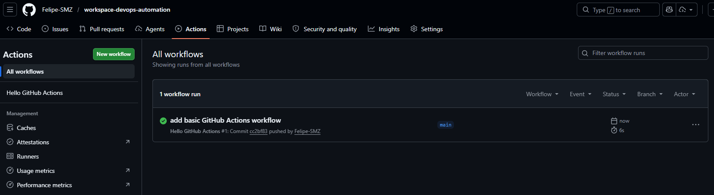
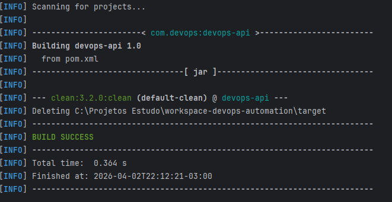
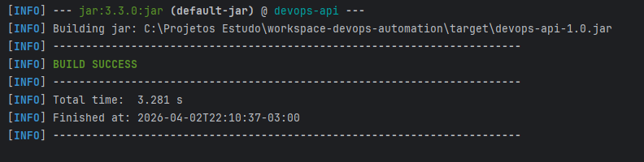
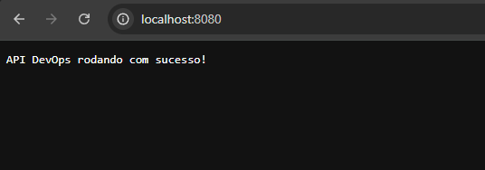
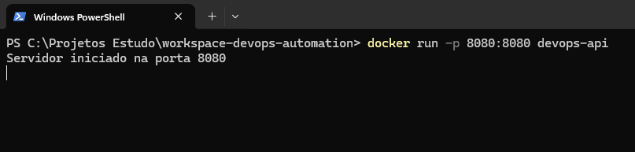
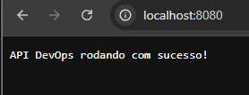
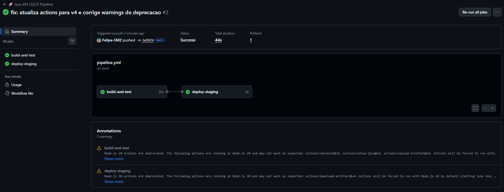

# 🚀 DevOps Automation Lab — CI/CD com GitHub Actions

> Projeto educacional desenvolvido para a disciplina de DevOps, com foco em automação de pipelines CI/CD utilizando GitHub Actions, Java, Maven e Docker.

---

## 📋 Índice

- [Segurança e Decisões de Projeto](#-segurança-e-decisões-de-projeto)
- [Lab 1 — Pipeline Básica](#-lab-1--pipeline-básica)
- [Lab 2 — CI/CD com Java e Docker](#-lab-2--cicd-com-java-e-docker)
- [Evidências](#-evidências)
- [Conclusão](#-conclusão)
- [Próximos Passos](#-próximos-passos)

---

## 🔐 Segurança e Decisões de Projeto

O roteiro original do Lab 2 solicitava clonar um repositório externo desconhecido e copiar seus arquivos diretamente para o projeto. Por razões de segurança, essa etapa foi **substituída por uma implementação própria**, mantendo todos os objetivos pedagógicos da atividade.

| Decisão | Motivo |
|---|---|
| ✅ Aplicação Java escrita do zero | Evitar execução de código de origem desconhecida |
| ✅ Uso apenas de actions oficiais do GitHub | `actions/checkout`, `actions/setup-java`, `actions/upload-artifact` são mantidas pelo GitHub |
| ✅ Imagem base Docker oficial | `eclipse-temurin:17-jdk-alpine` é mantida pela Eclipse Foundation / Adoptium |
| ✅ Scan de segurança simulado com `echo` | Evitar uso de ferramentas externas não auditadas em ambiente local |
| ✅ Nenhum `curl \| bash` ou script remoto | Nenhum comando baixa e executa scripts de fontes externas |
| ✅ Sem secrets expostos no código | Credenciais documentadas apenas como referência estrutural |

---

## 🧪 Lab 1 — Pipeline Básica

### 🎯 Objetivo

Validar o funcionamento do GitHub Actions com um workflow simples, configurando o repositório e disparando a primeira execução automatizada.

---

### 🏗️ Estrutura do Projeto

```
workspace-devops-automation/
├── .github/
│   └── workflows/
│       └── hello.yml
└── README.md
```

---

### ⚙️ Passos Executados

**1. Criar a estrutura local**

```bash
mkdir workspace-devops-automation
cd workspace-devops-automation
```

**2. Criar o repositório no GitHub**

- Acesse [https://github.com](https://github.com)
- Clique em **New Repository**
- Nome: `workspace-devops-automation`
- Deixe sem README e sem .gitignore (configurados localmente)

**3. Inicializar Git e conectar ao repositório remoto**

```bash
git init
git remote add origin https://github.com/Felipe-SMZ/workspace-devops-automation.git
echo "# Projeto DevOps Automation" > README.md
git add .
git commit -m "first commit"
git branch -M main
git push -u origin main
```

> **Nota:** O comando `git branch -M main` renomeia a branch local de `master` para `main` antes do push, evitando o erro `src refspec main does not match any`. Isso ocorre em instalações antigas do Git onde o nome padrão ainda é `master`.

**4. Criar a estrutura de diretórios do GitHub Actions**

```bash
mkdir -p .github/workflows
```

**5. Criar o arquivo de workflow**

Arquivo: `.github/workflows/hello.yml`

```yaml
name: Hello GitHub Actions

on:
  push:
    branches:
      - main

jobs:
  say-hello:
    runs-on: ubuntu-latest
    steps:
      - name: Exibir mensagem no log
        run: echo "✅ GitHub Actions funcionando com sucesso!"
```

> **Por que é seguro?** Este workflow não instala dependências externas, não acessa a internet e não executa nenhum binário além do `echo` nativo do sistema operacional.

**6. Subir para o GitHub**

```bash
git add .
git commit -m "add basic GitHub Actions workflow"
git push
```

---

### 📸 Evidência 1 — Pipeline Executada com Sucesso




---

## 🧪 Lab 2 — CI/CD com Java e Docker

### 🎯 Objetivo

Implementar uma pipeline completa cobrindo build, testes, containerização e simulação de deploy — com código 100% de autoria própria.

---

### 🏗️ Estrutura do Projeto

```
workspace-devops-automation/
├── .github/
│   └── workflows/
│       └── pipeline.yml
├── src/
│   ├── main/
│   │   └── java/
│   │       └── com/
│   │           └── devops/
│   │               └── App.java
│   └── test/
│       └── java/
│           └── com/
│               └── devops/
│                   └── AppTest.java
├── Dockerfile
├── pom.xml
└── README.md
```

---

### ☕ Aplicação Java

A aplicação é um servidor HTTP simples que responde na porta 8080, desenvolvida sem dependências de bibliotecas externas além da API padrão do Java.

**`src/main/java/com/devops/App.java`**

```java
package com.devops;

import com.sun.net.httpserver.HttpServer;
import java.io.OutputStream;
import java.net.InetSocketAddress;

public class App {
    public static void main(String[] args) throws Exception {
        HttpServer server = HttpServer.create(new InetSocketAddress(8080), 0);

        server.createContext("/", exchange -> {
            String response = "API DevOps rodando com sucesso!";
            exchange.sendResponseHeaders(200, response.getBytes().length);
            OutputStream os = exchange.getResponseBody();
            os.write(response.getBytes());
            os.close();
        });

        server.start();
        System.out.println("Servidor iniciado na porta 8080");
    }
}
```

**`src/test/java/com/devops/AppTest.java`**

```java
package com.devops;

import org.junit.Test;
import static org.junit.Assert.assertTrue;

public class AppTest {
    @Test
    public void testAppExists() {
        // Teste básico de sanidade — valida que a classe existe e é instanciável
        App app = new App();
        assertTrue(app != null);
    }
}
```

---

### 📦 Arquivo de Build — `pom.xml`

> ⚠️ Este arquivo é **obrigatório** para o Maven funcionar. Sem ele, o comando `mvn clean package` falha.

```xml
<?xml version="1.0" encoding="UTF-8"?>
<project xmlns="http://maven.apache.org/POM/4.0.0"
         xmlns:xsi="http://www.w3.org/2001/XMLSchema-instance"
         xsi:schemaLocation="http://maven.apache.org/POM/4.0.0
         http://maven.apache.org/xsd/maven-4.0.0.xsd">
    <modelVersion>4.0.0</modelVersion>

    <groupId>com.devops</groupId>
    <artifactId>devops-api</artifactId>
    <version>1.0</version>
    <packaging>jar</packaging>

    <properties>
        <maven.compiler.source>17</maven.compiler.source>
        <maven.compiler.target>17</maven.compiler.target>
        <project.build.sourceEncoding>UTF-8</project.build.sourceEncoding>
    </properties>

    <dependencies>
        <dependency>
            <groupId>junit</groupId>
            <artifactId>junit</artifactId>
            <version>4.13.2</version>
            <scope>test</scope>
        </dependency>
    </dependencies>

    <build>
        <plugins>
            <plugin>
                <groupId>org.apache.maven.plugins</groupId>
                <artifactId>maven-jar-plugin</artifactId>
                <version>3.3.0</version>
                <configuration>
                    <archive>
                        <manifest>
                            <mainClass>com.devops.App</mainClass>
                        </manifest>
                    </archive>
                    <finalName>devops-api-1.0</finalName>
                </configuration>
            </plugin>
        </plugins>
    </build>
</project>
```

---

### 🐳 Dockerfile

```dockerfile
# Imagem oficial mantida pela Eclipse Foundation / Adoptium
FROM eclipse-temurin:17-jdk-alpine

WORKDIR /app

COPY target/devops-api-1.0.jar app.jar

EXPOSE 8080

CMD ["java", "-jar", "app.jar"]
```

> **Por que `eclipse-temurin` e não `openjdk`?** A imagem `openjdk` foi descontinuada no Docker Hub. A `eclipse-temurin` é a substituta oficial, ativamente mantida e auditada pela Eclipse Foundation.

---

### ⚙️ Pipeline CI/CD — `.github/workflows/pipeline.yml`

```yaml
name: 🚀 Java API CI/CD Pipeline

on:
  push:
    branches: [ main ]
  pull_request:
    branches: [ main ]
  workflow_dispatch:

env:
  IMAGE_NAME: "java-api:${{ github.sha }}"

jobs:
  build-and-test:
    runs-on: ubuntu-latest

    steps:
      - name: 🔍 Checkout Code
        uses: actions/checkout@v3

      - name: ☕ Setup Java 17
        uses: actions/setup-java@v3
        with:
          distribution: 'temurin'
          java-version: '17'

      - name: 📦 Build com Maven
        run: mvn clean package

      - name: 🧪 Executar Testes
        run: mvn test

      - name: 🛠️ Build da Imagem Docker
        run: docker build -t ${{ env.IMAGE_NAME }} .

      - name: 🔐 Simulação de Scan de Segurança
        run: echo "✅ Scan de segurança simulado — nenhuma vulnerabilidade crítica encontrada"

      - name: 🚀 Simulação de Deploy
        run: echo "✅ Deploy simulado para ambiente de staging"

      - name: 📦 Upload do Artefato
        uses: actions/upload-artifact@v4
        with:
          name: devops-api-jar
          path: target/devops-api-1.0.jar

  deploy-staging:
    needs: build-and-test
    runs-on: ubuntu-latest

    steps:
      - name: 📥 Download do Artefato
        uses: actions/download-artifact@v4
        with:
          name: devops-api-jar

      - name: 🚀 Simulação de Deploy para Staging
        run: |
          echo "✅ Artefato recebido com sucesso"
          echo "📡 Deploy simulado para: https://staging.exemplo.com"
          ls -lh *.jar
```

> **Por que `actions/setup-java` em vez de `apt install`?**
> A action oficial é mantida pelo GitHub, tem versão fixada e é a abordagem recomendada. Instalar via `apt` no runner é mais lento, menos reproduzível e desnecessário.

---

### ⚙️ Passos para Executar

**1. Commitar todos os arquivos**

```bash
git add .
git commit -m "setup pipeline ci/cd com java e docker"
git push origin main
```

**2. Verificar a execução no GitHub**

Acesse: GitHub → aba **Actions** → pipeline `Java API CI/CD Pipeline`

---

## 📸 Evidências

### Evidência 2 — Build Maven com Sucesso


```bash
mvn clean package
```





---

### Evidência 3 — Aplicação Rodando no Navegador


```bash
java -jar target/devops-api-1.0.jar
# Acesse: http://localhost:8080
```



---

### Evidência 4 — Container Docker Funcionando


```bash
# Build da imagem
docker build -t devops-api .

# Executar o container
docker run -p 8080:8080 devops-api

# Acesse: http://localhost:8080
```





---

### Evidência 5 — Pipeline Completa com Todos os Steps Verdes

> **Como capturar:** GitHub → **Actions** → clique na execução da pipeline → tire print mostrando todos os steps com ✅



---

## 🧠 Conclusão

O projeto demonstra na prática o funcionamento de um pipeline CI/CD moderno, cobrindo:

- **GitHub Actions** como plataforma de automação
- **Java + Maven** para build e testes
- **Docker** para containerização da aplicação
- **Boas práticas de segurança** em todas as etapas

A principal adaptação em relação ao roteiro original foi a substituição do clone de um repositório externo por uma implementação própria, garantindo rastreabilidade total do código executado no ambiente local e na pipeline.

---

## 🚀 Próximos Passos

- Implementar deploy real no Azure Container Registry (ACR) ou Docker Hub
- Adicionar testes de integração mais robustos
- Integrar scan de segurança real com Trivy (quando em ambiente controlado)
- Configurar ambientes de staging e produção separados na pipeline